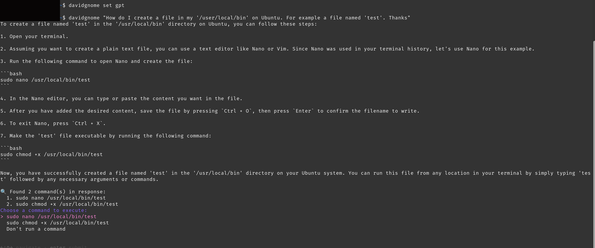
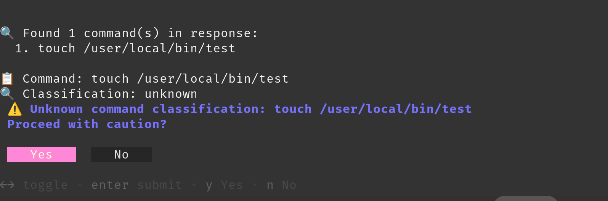
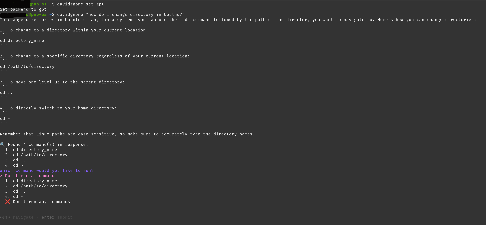
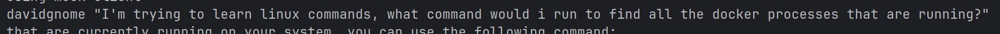

### 10-15 MINUTES
<h2 align='center'> Your own 'AI Driven Terminal Helper' in Minutes :computer:

<h3 align='center'> Works on any Distro, even WSL2 and MACOS (with some adjustments)
<br>
<br>

<br>
<br>

<br>

# Disclaimer
- I made this project for my own use, and to demonstrate that you don't need to pay $18 a month for an AI driven terminal, no matter how much they spend on advertising.
- I've been using it solely on my sandbox NVME, separated from the rest of my network, on a drive that I don't mind 
losing.
- Using it with small models for anything other than testing, is highly inadvisable. Using it with online models is less risky, but you do so at your own.
- Bear in mind that I created this in 4-6 hours by vibecoding, rotating between Claure 4, GPT4o and Gemini 2.5 in my PyCharm IDE, switching one out when it couldn't fix a problem, and making them write their own backend files.
- During this time I was studying Hugging Face Courses on one PC, tuning a model on yet another, cooking and 
eating food, making coffee.. you get the idea. Don't use this for anything serious.
- I spent so little time on this (about 1 hour to test) because i'm working on a far superior beta using multiple 
models and smolgents, armed with tools, all running off enterprise grade tech
- To create our own 'AI Powered Linux Terminal', there's a few steps to take. I do my coding on POP'OS! which is Ubuntu based, but you can use this on any distro, and name it whatever you like. Call it 'warp_lightning' for all I care, just be sure to update any instances of the name in the code.
  - We'll be installing:
The [Brew](*"https://docs.brew.sh/Homebrew-on-Linux"*) package manager, in order to install [gum](*"https://github.com/charmbracelet/gum/tree/main"*). 
    >If you can't install brew and gum for whatever reason then don't worry, the code defaults to markdown instead.
  - Ollama, but you can easily put a backend in for Hugging Face or whatever.
  - Finally, we need to grab a model to run with ollama, but the code has a backend for 'GPT', 'Claude' and 'Gemini', all of which were used to vibecode this in [PyCharm](*"https://www.jetbrains.com/pycharm/?msclkid=5e3a2b39eaec1937c269436942aae285&utm_source=bing&utm_medium=cpc&utm_campaign=EMEA_en_GB_PyCharm_Branded&utm_term=pycharm&utm_content=pycharm*). 
Use whichever you wish, just put your API_Key variable in the relevant backend.
  - > I'm using my own model in this example, which I won't post yet as its work in progress. Its currently a Linux tuned Gemma model, but i'm going to try a Qwen also. If you'd like to test with a local model, I'd advise a `code`model such as a larger Qwen.
Grab either one of those from Hugging Face, LMStudio, or wherever you get your models

- ## What it can, and can't do
- ### davidgnome CAN:
	- Access your terminal history to send in each prompt. These keep the model informed so you don't have to paste 
      pages into your chosen LLM.
    - Access your system spec send in each prompt.
    - Run commands from the terminal ONLY if you select them.
    - Access your terminsal history (this and system info are sent as part of the prompt, so disable if that isn't something you want.
    - Provide warnings and checks if the prompt response IF the commands fall under the ones I could arbitrarily remember should be used with caution. NOT everything is covered here.
    - Send your data to online models (don't put in an API key for any of the online ones if you don't want this)
    - Send your data to a local LLM, therefore not leaving your PC.
- ### davidgnome CAN'T:
	- Access any files on your PC, without you specifically asking it to.
	- Run any checks and balances on its output other than those which the providers or creators have put in place.
- > If you haven't already created an environment variable for your chosen LLM, do so now in your os / the relevant `_backend.py`
  Example: I use GPT when not in an IDE, so where I have the below in GPT_backend.py:
  ```
  # Read the key from the environment
  API_KEY: str | None = os.getenv("OPENAI_API_KEY")
  ```
- Now that's over with, lets get to it.
- ## Usage:
- Once you've installed the files via the README, open any terminal.
- Set the API by choosing between `ollama`, `claude`, `gpt`, `gemini`:
  ```
  davidgnome set ollama
  ```
- To use davidgnome, we simply type `davidgnome "I have a question about Linux which I will remember to put in double quotes"`
- press `enter`
- Here's examples:

- ### Online Models
- As mentioned, online models will pretty much give the correct answers in the same way as using them in the way 
  you normally would. This is GPT 3.5
<br>

<br>
- Small Models through Ollama are a bit of a lottery. 
- Its usueful to have a tiny helper for simple queries, but I wouldn't run anything with `sudo` below 30B personally.
<br>

<br>

- davidgnome will provide an explanation, then offer the options for the command. Results may vary dependant on the model. You may also have to play around with the system prompt for small models.
- I have tested a much longer prompt template with the small models, and strangely enough they performed far worse with a longer prompt template. This may well be due to the system info and terminal history pushing the context windows limits.
- If the code is flagged as potentially having risk, or if it is not on the list of risky commands (that I could remember offhand, with little thought), it will be flagged and you need to press 'Y' for 'Yes', or 'N' for 'No'.
<br>

<br>
- You'll also have to type your password in for sudo obviously.
<br>

<br>
  - ## Installation Steps
  - Step 1: Download the project files and place them somewhere sensible, for example I put mine as follows:
    
  ```
    ~/.config/davidgnome/config.json     # Saves backend preference
    /usr/local/bin/davidgnome            # CLI entrypoint
    ~/davidgnome/                        # Main Python logic
        ├── __init__.py
        ├── config.py                   # Reads/writes backend config
        ├── config.json                 # Stores backend config
        ├── gpt_backend.py              # Calls OpenAI
        ├── ollama_backend.py           # Calls Ollama
        ├── claude_backend.py           # Calls 
        ├── gemini_backend.py           # Calls gemini
        ├── utils.py                    
        └── main.py                     # Core logic + gum usage

- if you place yours somewhere else, be sure to change this line in the bash script 
````
    python3 ~/davidgnome/main.py "$@"
````
- Step 2: Place the bash script (/usr/local/bin/davidgnome) in its folder, and run:
```
sudo chmod +x /usr/local/bin/davidgnome
```
- Step 3: Install ollama on your machine.
```
sudo apt install && sudo apt update
```
```
curl -fsSL https://ollama.com/install.sh | sh
```
- Step 4: Install `brew`
```
/bin/bash -c "$(curl -fsSL https://raw.githubusercontent.com/Homebrew/install/HEAD/install.sh)"
```
Set the PATH variable with:
```
echo "eval \"\$($(brew --prefix)/bin/brew shellenv)\"" >> ~/.bashrc
```
- Step 5: Install 'gum'
```
brew install gum
```
- Checks its there with:
```
ollama list
```
- Step 5: Place the linux_gnome model in any folder that works. I keep all mine in `~/.lmstudio/models`.
- The model should be in its own directory, so mine is in: `~/.lmstudio/models/linux_gnome`
- create a text file in the directory:
  `cd ~/.lmstudio/models/linux_gnome`
- call the file 'Modelfile'
```
nano Modelfile
```
- in the Modelfile write:
```
FROM gguf:linux_gnome
```
`control + o` to save the file, then `control + x` to exit
- Step 6: In your terminal run:
```
ollama run linux_gnome
```
- >The terminal will turn into model chat, but you can just leave that terminal then we'll use it in any other terminal we create.
  However if you'd like to chat with the model, then go ahead!
- Step 7: Open another terminal, then go ahead and ask davidgnome a question. The format is: `davidgnome "my question here in double quotes"`
<br>

<br>
- # USE WITH CAUTION AND AT YOUR DISTRO'S OWN PERIL
-
- ### Optional Steps (but advised)
- Step 8
- To save having to remember and type loads of model names if you switch them with ollama, its helpful to have aliases.
	- Lets create one in our bash. 
	  ```
	  nano ~/.bashrc
	  ```
	  Note: If you use 'fish' or similar then use `~/.local/share/fish/fish_history`or equivalent
- Scroll down to around (usually) one third up from the bottom, just above the line `# Alias definitions` or wherever you put them on your machine
	- ```
	      alias dgnomeup='ollama run linux_gnome'
	      alias dgnomedown='ollama stop linux_gnome'
	  ```
   Now you can refresh, load or unload the model in ollama using `davidgnomeup`and `davidgnomedown`


### Thats it! I've hardly tested it, the code and documentation are poorly laid out, but its fun. 
### The main point is that it acts as a scaffold for a much bigger project

